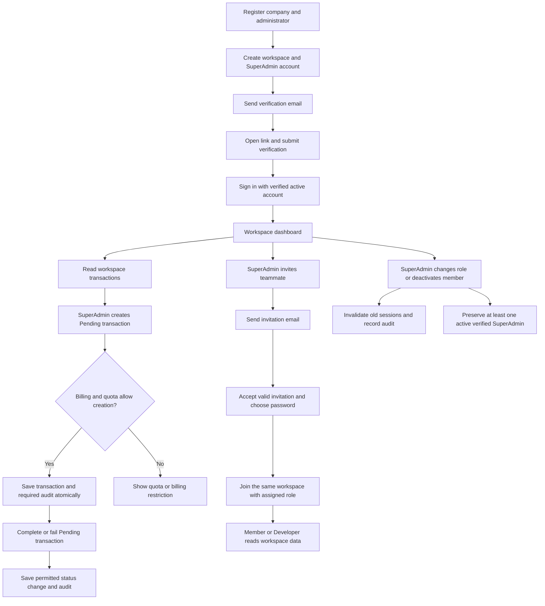
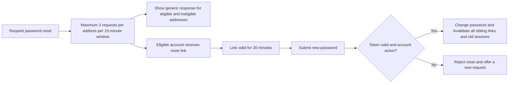
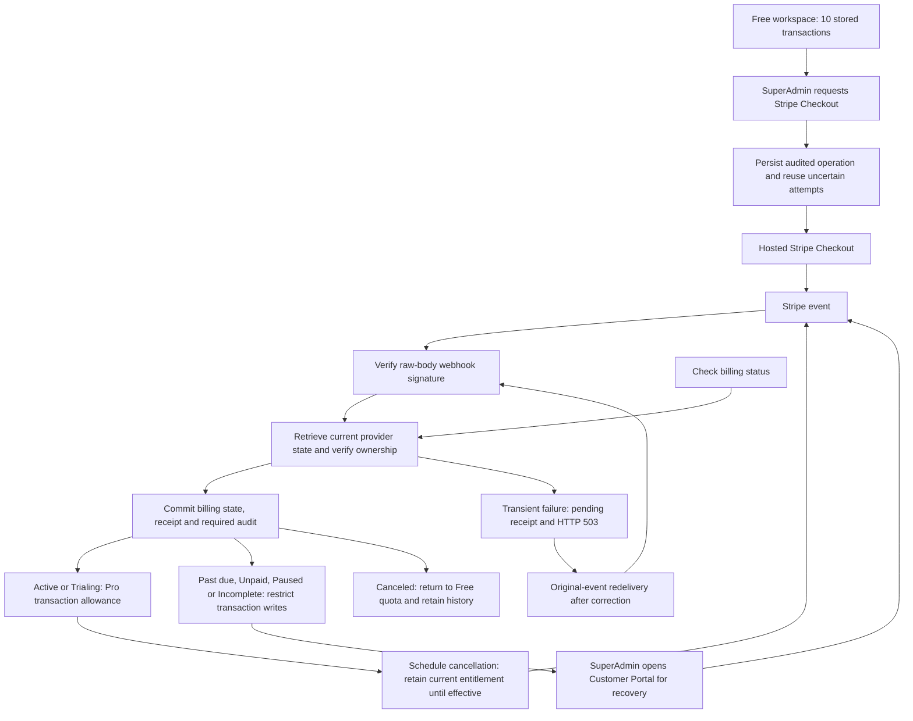
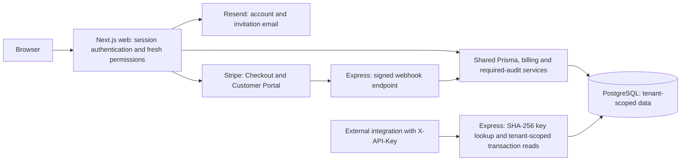

# Nexrole project flow

Nexrole is a multi-tenant B2B SaaS starter with workspace onboarding, role-based access, transaction management, Stripe subscriptions, developer API keys and required mutation audits. These diagrams describe the implemented MVP flows. Updated 2026-10-05.

## Workspace journey

Management actions derive the actor and workspace from fresh server-side membership. Client-supplied tenant or actor fields cannot select another workspace. Member and Developer roles retain read access; administrative mutations require SuperAdmin permissions. Transaction status changes also require permitted billing state and a Pending transaction.

## Account recovery

Requesting another email does not invalidate an earlier reset link. Using any valid reset link invalidates the others. Verification links last 24 hours. Opening a link alone does not consume it; submission performs validation.

## Billing and recovery

Webhook snapshots and checkout return URLs do not grant Pro access. Reconciliation uses current Stripe state, tenant/customer/subscription ownership and configured price. Duplicate and delayed events must not duplicate transition audits or restore stale entitlements. Unknown billing states deny transaction writes. Account recovery, workspace reads and authorized membership/billing recovery remain available during restrictions.

**Check billing status** reconciles current state; it does not drain pending webhook receipts. Follow [Webhook recovery](WEBHOOK_RECOVERY.md) for diagnosis and original-event redelivery. No scheduled receipt-replay worker is implemented.

## Application and integration boundaries

Web reads and server actions access shared database services directly. The Express transaction API provides authenticated reads; it is not the transport for web mutations. API keys are stored as hashes, bind requests to a workspace, and cease authorizing new requests after revocation. Critical local mutations roll back if their required audit cannot be persisted. External email/payment outcomes have explicit recovery boundaries.

## Showcase and verification status

| Area                            | Evidence and remaining boundary                                                                                                                                                                                                                        |
| ------------------------------- | ------------------------------------------------------------------------------------------------------------------------------------------------------------------------------------------------------------------------------------------------------ |
| Core features 8.2-8.5           | Implemented with automated account, transaction, membership, authorization, billing and audit coverage.                                                                                                                                                |
| Release checkpoints 8.6.1-8.6.4 | Local acceptance checks complete; [release matrix](RELEASE_ACCEPTANCE.md) records tests and limits.                                                                                                                                                    |
| Real Stripe sandbox             | Upgrade, failure, recovery, scheduled and effective cancellation verified with user-assisted hosted UI and independent checks. Natural renewal/expiry and automatic CLI redelivery were not observed. See [billing acceptance](BILLING_ACCEPTANCE.md). |
| Real Resend email               | User reported successful verification and password-reset delivery on 2026-10-05, followed by successful Change password. This is user-reported manual evidence. Invitation delivery to another recipient/domain is not yet verified.                   |
| Deployment and final acceptance | 8.6.5 Docker/clean-deployment smoke, 8.6.6 final regression and 8.6.7 release documentation/exit gate remain pending. The project is not yet claimed publicly production-ready.                                                                        |

## UI screenshots and export

The [application screenshot gallery](SCREENSHOTS.md) pairs these diagrams with current dashboard, transaction, Company Profile/billing, Team Members and integration views. Use a demo workspace and redact email addresses, provider IDs, keys and token-bearing URLs. Historical screenshots may show older typography or badge styles; capture the current UI after refreshing it.
